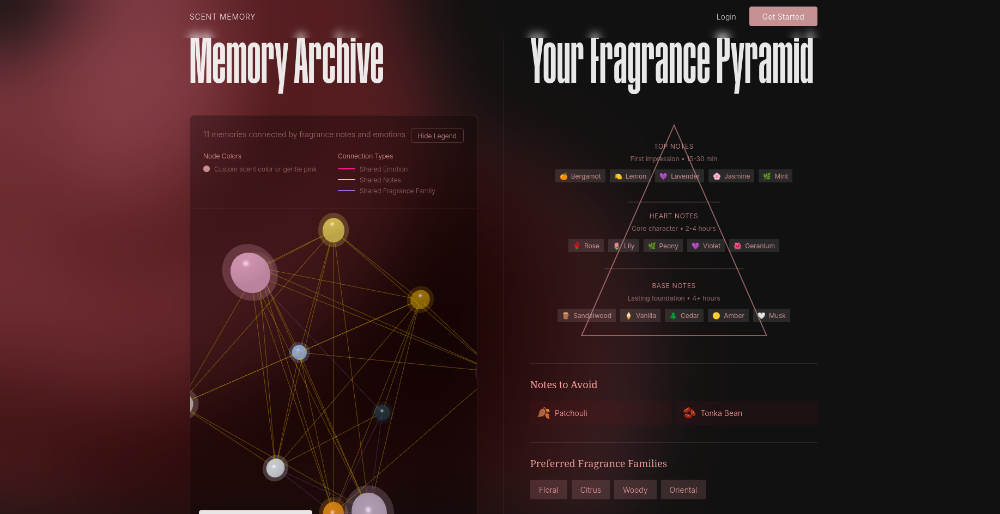

# Flowery

Flowery recommends perfumes by learning from a user’s personal scent memories and contextual behavior.
Instead of asking users to describe their taste upfront, the system builds preference understanding over time through memories, queries, and feedback.

build in public @portable_writer on X

## How Flowery Works

- A **User** owns memories and preferences
- Each **ScentMemory** represents one uploaded experience (image, text, PDF, audio)
- Memories are split into **MemoryChunks** for vector-based retrieval
- Memories and chunks generate **ExtractedScents**, which update the user’s **ScentProfile**
- User queries generate **QueryLogs**, which may create **Recommendations** and **TrainingExamples**
- **Fragrance** and **FragranceNote** form a global scent taxonomy
- **ImageAnalysis** enriches memories with visual context
- **FineTuningJob** tracks ML fine-tuning over accumulated training data

## User Workflow

1. User uploads a memory
2. `ScentMemory` is created
3. Background processing:
   - Image analysis with OpenAI
   - Text enhancement
   - Chunking
   - Embedding
   - Scent extraction with OpenAI
   - (got rid of music bc not sure of legal stuff)
4. User submits a query
5. Relevant chunks and profile data are retrieved
6. LLM generates recommendations
7. User feedback updates analytics and training data
8. Periodic fine-tuning improves personalization

## Next Steps

- Build FastAPI endpoints (auth, upload, query) ✅
- Add Celery tasks for document processing ✅
- Integrate a vector database (ChromaDB) ✅
- Connect LLM providers (OpenAI) ✅
- Automate fine-tuning and deployment ✅
- Frontend Design ✅
- Frontend Websockets ✅
- Frontend -> Graph Visuals with Three.js ✅
- Load Caching ✅
- Limit to Three Memories Upload/Day ✅
- Processing of images and pdfs happens in transit ✅
- Basic Testing ✅

Basically:

1. Vision AI for image uploads ✅
2. Scent Extraction ✅
3. Auto-update ScentProfile ✅
4. PDF Processing ✅
5. Genius Api for song processing ✅

## Deadline
01.01.2026

## Security

- ✅ Input sanitization (HTML/XSS prevention)
- ✅ Rate limiting (60 req/min)
- ✅ CORS restrictions
- ✅ Security headers
- ✅ Admin-only endpoints for Fine-Tuning based on Past Queries with High Ratings
- ✅ Password requirements
- ✅ SQLAlchemy prevents SQL injection
- ✅ JWT token expiration
- ✅ Environment-based config

## Model Logic

erDiagram

    User ||--o{ ScentMemory : "owns"
    User ||--|| ScentProfile : "has"
    User ||--o{ QueryLog : "creates"
    User ||--o{ UserFragrance : "collects"
    
    ScentMemory ||--o{ MemoryChunk : "splits_into"
    ScentMemory ||--|| ImageAnalysis : "analyzed_by"
    ScentMemory ||--o{ ExtractedScent : "contains"
    
    QueryLog ||--o{ Recommendation : "generates"
    
    Fragrance ||--o{ UserFragrance : "collected_by"
    Fragrance ||--o{ Recommendation : "recommended"
    Fragrance ||--o{ ExtractedScent : "matches"
    Fragrance }o--o{ Note : "contains"
    
    FineTuningJob ||--o{ TrainingExample : "uses"

